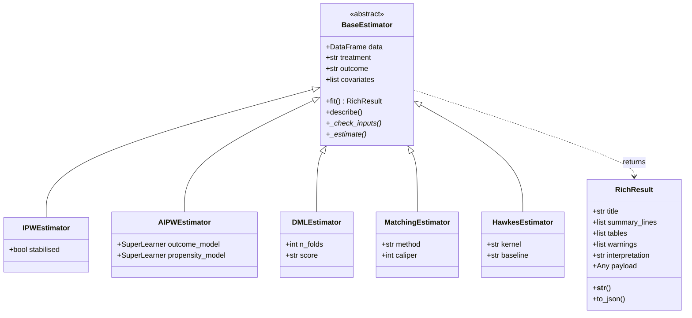
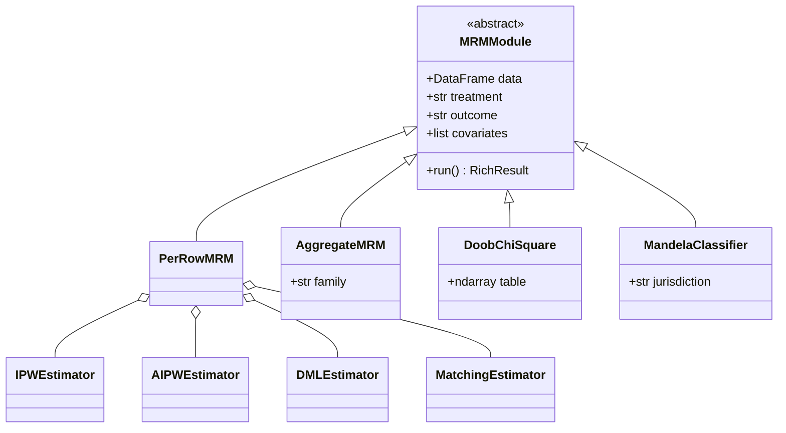

<div align="center">
  
</div>

## 👋 Hi, I'm Vee

<p align="center">

</p>

### 🚀 Building tools that make science reproducible and accessible.

- 🎓 **University of Toronto**
- 💻 Contributor to [**MOIRAIS**](https://github.com/hadesllm/moirais) — dual-language (Python + R) scientific computing toolkit
- 🧠 **Causal inference, DML, IPW/AIPW, spatial analysis, IRT, post-quantum crypto**
- ⚡ ML on **Raspberry Pi 5** with TurboQuant (ICLR 2026)

---

## ⭐ Flagship: MOIRAIS

<div align="center">

[](https://pypi.org/project/moirais/)
[](https://pypi.org/project/moirais/)
[](https://hadesllm.r-universe.dev/moirais)
[](https://www.gnu.org/licenses/old-licenses/gpl-2.0)
[](https://doi.org/10.5281/zenodo.20096350)

</div>

**[MOIRAIS](https://github.com/hadesllm/moirais)** — *Methods for Observational
Inference and Robust Analysis of Interventions in Scientific Experimentation* —
is a multi-domain scientific computing toolkit hosting the **MRM
(McNamara-Ruhela-Medina) framework** as its primary application for Canadian
carceral, police, and oversight data. Python + R parity across the same
estimators; 60+ built-in datasets shipped in a portable SQLite layer.

| Surface | What |
|---|---|
| **Causal estimators** | ATE / ATT / ATC / GATE / CATE / LATE, AIPW, G-computation, DML (PLR / IRM / PLIV), PSM, Rosenbaum bounds, E-value |
| **MRM framework** | 10-estimator ensemble + Mandela classifier (UN Rules 43/44) + Doob χ² + provincial-vs-federal cross-comparison |
| **Spatial statistics** | Moran's I, LISA, Getis-Ord G\*, kriging, GWR, Ripley's K/L, Kulldorff space-time scan |
| **Hawkes processes** | Markovian Mohler-Bertozzi-Brantingham + non-Markovian Kwan-Chen-Dunsmuir kernels (Gamma / Weibull / Lomax) |
| **Statistical physics of crime** | Short-Brantingham reaction-diffusion, Bettencourt urban scaling, Lévy-flight tail, Lotka-Volterra |
| **Survey-weighted inference** | Horvitz-Thompson, Hájek, raking, complex-survey GLM, bootstrap + jackknife |
| **Psychometrics** | Cronbach α, McDonald ω, IRT (1PL/2PL/3PL/GRM), DIF, parallel analysis (250+ functions) |
| **Carbon-aware computing** | Pure-Python emissions tracker with 213-country IEA carbon-intensity data |

```python
import moirais
df = moirais.load_dataset("otis-2025")

# MRM module on OTIS data
from moirais.otis_all_analyze import analyze_a01_mrm
result = analyze_a01_mrm(df)
print(result)
```

```r
library(moirais)
cpads <- moirais_load_dataset("cpads_2021")
ate   <- estimate_ate(cpads, "outcome", "treatment", c("age", "sex"))
```

<div align="center">

[](https://github.com/hadesllm/moirais)
[](https://hadesllm.github.io/moirais/)

</div>

> Methodology partners: **Glenn McNamara** (35-year career with the Ontario Government) — catalyst; **Prof. Angela Zorro Medina** (Centre for Criminology & Sociolegal Studies, UofT) — supervisor, methodological instructor, domain-expert reviewer, and knowledge user. AI assistance via Anthropic Claude + Google Gemini / Vertex AI research-credit programs.

### 🧩 Architecture (estimator spine)

Every analysis function in MOIRAIS returns a `RichResult`. Estimator
hierarchies share a common `BaseEstimator` contract; concrete classes
specialise it for a particular causal / spectral / sampling method.



The MRM framework composes ten of these `BaseEstimator` subclasses on
a single (treatment, outcome, covariates) design and reports them in
one aggregate `RichResult`.



---

## 🛠️ Technical Skills

<div align="center">


</div>

---

## 📜 Research Interests

My research sits at the intersection of public-health epidemiology and
modern causal-inference methodology. On the substantive side I work on
environmental-health determinants of mental health and substance use,
and correctional and police-oversight data (Ontario OTIS, federal
SIU, Toronto Police Service) — drawing on Canadian PUMFs (CPADS,
CCS, CSADS, CSUS, CADS) and CIHI / PHAC aggregates. On the methodological side I focus on semiparametric
causal inference (double machine learning, AIPW, G-computation,
TMLE), Hawkes self-exciting point processes for spatiotemporal
crime data, spatial statistics (Moran's I, kriging, GWR), and
post-quantum cryptography for privacy-preserving analytics. Most of
this lives in MOIRAIS as composable estimators sharing a single
`RichResult` contract.

---

## 📦 Selected Publications

- Ruhela, V. S. (2026). **MOIRAIS: A Multi-Domain Scientific Computing Toolkit for Observational Inference, with Sociolegal, Signal-Processing, Cryptographic, and Spatial-Statistics Modules.** Zenodo. https://doi.org/10.5281/zenodo.20096350
- Ruhela, V. S. (2026). **The MRM Framework: A Multi-Source Statistical Foundation for Canadian Carceral, Police, and Oversight Data, Implemented as MRM Modules in MOIRAIS.** Zenodo. https://doi.org/10.5281/zenodo.20096075
- Ruhela, V. S. (2026). **Criminological Hawkes Process via MOIRAIS: Markovian and Non-Markovian Self-Exciting Point Processes for Toronto Crime.** Zenodo. https://doi.org/10.5281/zenodo.20102198

---

## 🌐 Let's Stay Connected

<div align="center">

[](https://github.com/rootcoder007)
[](https://github.com/hadesllm)
[](https://pypi.org/project/moirais/)
[](https://orcid.org/0009-0004-1750-3592)
[](mailto:hadesllm@proton.me)

</div>

---

<div align="center">

</div>

<br/>

<div align="center">

</div>
